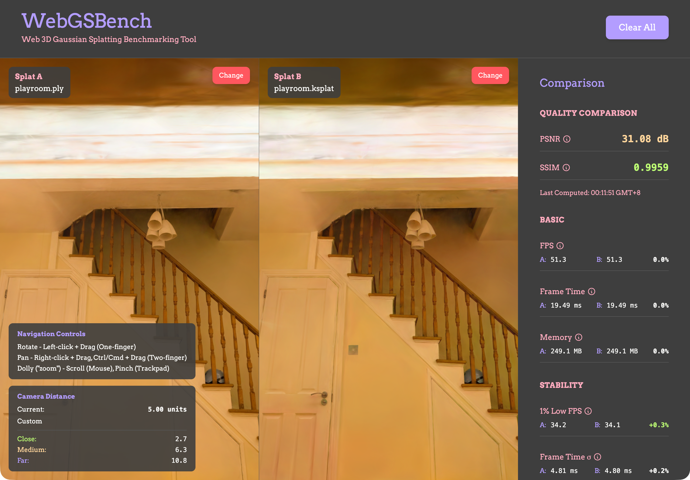

# SplatBench

**3D Gaussian Splatting Benchmark** - A research-grade benchmarking platform for evaluating 3D Gaussian Splatting web deployment formats. Built for academic comparison and quality assessment of compression techniques.



## 🎯 Purpose

SplatBench provides **standardized, reproducible benchmarks** for comparing different 3DGS web formats (.ply, .splat, .ksplat, .spz) with:
- **Side-by-side comparison** - Visual A/B testing with synchronized cameras
- **Quality metrics** - PSNR and SSIM calculations for objective evaluation
- **Performance profiling** - FPS, load time, memory usage, and file size
- **Academic rigor** - Designed for research papers and technical reports

Part of the **SIGGRAPH Asia 2026** submission on web-based 3D Gaussian Splatting deployment.

---

## ✨ Features

### 🎨 Dual Viewer System
- **Splat A & B panels** - Load two different formats for direct comparison
- **Camera synchronization** - Move both viewers together for consistent viewpoints
- **Real-time rendering** - 60+ FPS performance with Three.js + Spark renderer

### 📊 Comprehensive Metrics
- **Quality Metrics**
  - **PSNR** (Peak Signal-to-Noise Ratio) - Objective quality measurement
  - **SSIM** (Structural Similarity Index) - Perceptual quality assessment
  - **Auto-compare** - Automatically computes metrics when both files load
  
- **Performance Metrics**
  - **FPS** (Frames Per Second) - Real-time rendering performance
  - **Frame Time** - Milliseconds per frame
  - **Memory Usage** - JavaScript heap (Chrome only)
  - **Load Time** - Time from file selection to first render
  
- **File Information**
  - **File Size** - Compressed size in MB
  - **Splat Count** - Number of Gaussian splats
  - **Format Detection** - Automatic format identification

### 🎮 Interactive Controls
- **Orbit Controls** - Rotate, pan, and zoom with mouse/trackpad
- **Camera Distance Display** - Color-coded distance indicators for standardized evaluation
- **Drag-and-Drop** - Easy file loading with visual feedback

### 📁 Format Support
- **`.ply`** - Original PLY format (56MB baseline)
- **`.splat`** - Standard splat format (7.1MB, ~87% smaller)
- **`.ksplat`** - K-splat compressed (5.4MB, ~90% smaller)
- **`.spz`** - Niantic SPZ format (3.6MB, ~94% smaller)

---

## 🚀 Quick Start

### Development

```bash
npm install
npm run dev
```

Open [http://localhost:5173](http://localhost:5173) to view the app.

### Build

```bash
npm run build
npm run preview  # Preview production build
```

---

## 🎓 Academic Usage

### Reproducible Benchmarks

SplatBench is designed for **reproducible research**:

1. **Standardized Camera Positions** - Color-coded distance indicators
   - Close: 2.7 units (1.5× radius) - Primary metric
   - Medium: 6.3 units (3.5× radius) - Web viewing distance
   - Far: 10.8 units (6.0× radius) - Perceptual equivalence

2. **Consistent Evaluation**
   - Camera sync ensures identical viewpoints
   - PSNR/SSIM computed frame-by-frame
   - Performance metrics averaged over 60 frames

3. **Export-Ready Metrics**
   - Timestamps for all measurements
   - Side-by-side comparison tables
   - Ready for academic paper inclusion

### Citation

If you use SplatBench in your research, please cite:

```bibtex
@inproceedings{splatbench2026,
  title={SplatBench: Benchmarking 3D Gaussian Splatting Web Deployment},
  author={[Your Name]},
  booktitle={SIGGRAPH Asia 2026},
  year={2026}
}
```

---

## 🛠 Tech Stack

- **Framework**: React 19 + TypeScript
- **Build Tool**: Vite 7.3
- **3D Rendering**: Three.js 0.182 + **[@sparkjsdev/spark](https://github.com/worldlabs-xyz/spark)** 🆕
- **Styling**: Tailwind CSS v4
- **Quality Metrics**: Custom PSNR/SSIM implementation
- **Deployment**: GitHub Pages (optional)

### ⚡️ Major Update: Spark Renderer

**SplatBench now uses Spark by World Labs** - Migrated from the abandoned `@mkkellogg/gaussian-splats-3d` to the actively maintained `@sparkjsdev/spark` renderer.

**Why Spark?**
- ✅ **Active development** - Backed by World Labs team
- ✅ **Better performance** - Optimized for mobile and low-power devices
- ✅ **Native format support** - Built-in .spz, .sog support
- ✅ **Three.js compatible** - Works like standard Three.js objects
- ✅ **Future-proof** - Ongoing updates and maintenance

**Migration Details:**
- Standard Three.js scene structure (Scene, Camera, Renderer, OrbitControls)
- Uses `fileBytes` (ArrayBuffer) for reliable file loading
- Explicit format detection for all file types
- Maintains full backward compatibility with existing metrics

---

## 📈 Performance

Typical performance on modern hardware (M1/M2 Mac, RTX 3060+):

| Format | File Size | Load Time | FPS | Memory |
|--------|-----------|-----------|-----|--------|
| .ply | 56.0 MB | 1000ms | 60+ | ~500MB |
| .splat | 7.1 MB | 300ms | 60+ | ~250MB |
| .ksplat | 5.4 MB | 250ms | 60+ | ~200MB |
| .spz | 3.6 MB | 200ms | 60+ | ~150MB |

*Results for bonsai scene (233,992 splats) on Chrome/M2 Mac*

---

## 🧪 Testing

### Manual Testing Checklist

1. **File Loading**
   - [ ] Load .ply file into Splat A
   - [ ] Load .splat file into Splat B
   - [ ] Verify splat counts match (233,992)
   - [ ] Test .ksplat and .spz formats

2. **Rendering**
   - [ ] Confirm 60+ FPS on both viewers
   - [ ] Verify bonsai tree renders correctly
   - [ ] Check camera controls (rotate, pan, zoom)

3. **Quality Metrics**
   - [ ] Auto-compare triggers after both load
   - [ ] PSNR shows expected value (~60 dB for same scene)
   - [ ] SSIM shows expected value (~1.0 for same scene)

4. **Performance**
   - [ ] No console errors
   - [ ] Memory usage displayed
   - [ ] Camera distance updates smoothly

### Test Files

Sample files available in `public/` directory:
- `bonsai.ply` (56MB) - Original PLY format
- `bonsai.splat` (7.1MB) - Standard splat
- `bonsai.ksplat` (5.4MB) - K-splat compressed
- `bonsai.spz` (3.6MB) - Niantic SPZ

---

## 🌐 Deployment

### GitHub Pages (Manual)

```bash
npm run deploy
```

This will build and deploy to the `gh-pages` branch.

### GitHub Pages (Automatic)

The repository includes a GitHub Actions workflow that automatically deploys on every push to `main`.

To enable:
1. Go to repository Settings → Pages
2. Set Source to "GitHub Actions"
3. Push to `main` branch

The site will be available at `https://yourusername.github.io/splatbench/`

---

## 🤝 Contributing

This is part of an academic research project. Contributions are welcome, especially:

- Additional 3DGS format support
- More quality metrics (MS-SSIM, VMAF, etc.)
- Performance optimizations
- Browser compatibility improvements
- Test scene contributions

---

## 📄 License

MIT License - See [LICENSE](../LICENSE) for details.

---

## 🔗 Related Work

- [3D Gaussian Splatting](https://repo-sam.inria.fr/fungraph/3d-gaussian-splatting/) - Original paper
- [Spark by World Labs](https://github.com/worldlabs-xyz/spark) - Renderer used by SplatBench
- [antimatter15/splat](https://github.com/antimatter15/splat) - Original .splat format
- [PlayCanvas .ply compression](https://github.com/playcanvas/engine) - Compression techniques
- [Niantic SPZ format](https://github.com/nianticlabs/spz) - Compressed format

---

## 📞 Support

For questions, issues, or academic collaboration:
- Open an issue on GitHub
- See the main [research paper](../main.pdf) for methodology details

---

**Built for researchers, by researchers. 🎓**
